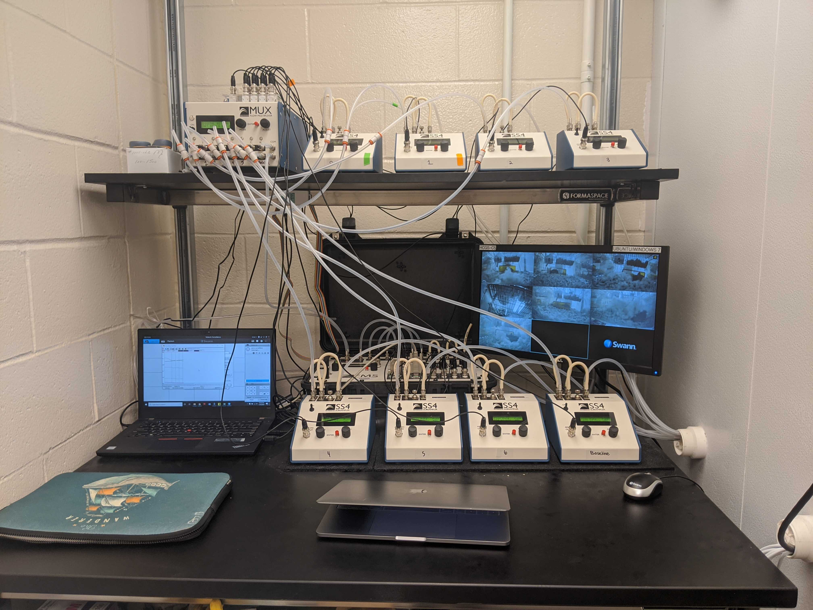

</script>

 

***

## __EDUCATION__

### __Univeristy of New Hampshire__, Durham, NH
- Present - __Ph.D Molecular and Evolutionary Systems Biology __;  
    Genotypic and phonotypic consequences of desert physiology
 
    Advisor: Matt MacManes 

### __University of Wisconsin - Stevens Point__, Stevens Point, WI    
- 2019 - __M.Sc. in Natural Resources __;  
    M.Sc. Thesis, The first haploid linkage map in a coregonid _(Coregonus artedi)_ improves knowledge of chromosomal evolution and rediploidization across Salmonids.
 
    Advisor: Wes Larson 
    
### __Michigan State Univeristy__, East Lansing, MI  
- 2017 - __BS in Zoology__ 
  Concentration: Ecology, Evolution, and Organismal Biology  
  Minor: Environmental Studies and Sustainability 

***
## __PUBLICATIONS__ 
__Blumstein DM__, Colella, JP, E Linder, and MacManes, MD. High total water loss driven by low-fat diet in desert-adapted mice. bioRxiv 2022.04.15.488461; doi: https://doi.org/10.1101/2022.04.15.488461

Colella, JP, __DM Blumstein__, and MD MacManes. 2021. Disentangling environmental drivers of circadian metabolism in desert-adapted mice. Journal of Experimental Biology. 224 (18): jeb242529.

__Blumstein, DM__, Campbell, M. A., Hale, M. C., Sutherland, B. J., McKinney, G. J., Stott, W., & Larson, W. A. (2019). Comparative genomic analyses and a novel linkage map for cisco _(Coregonus artedi)_ provides insight into chromosomal evolution and rediploidization across salmonids. G3, 10(8):2863-2878.

__Blumstein, DM__, The first haploid linkage map in a coregonid _(Coregonus artedi)_ improves knowledge of chromosomal evolution and rediploidization across Salmonids. _Master's thesis. University of Wisconsin-Stevens Point_ 

__Blumstein, DM__, Mays D, Scribner KT. (2017). Spatial genetic structure and recruitment dynamics of burbot (Lota lota) in Eastern Lake Michigan and Michigan tributaries. _Journal of Great Lakes Research_, 44(1):149-156. 

Waraniak JM, __Blumstein DM__, Scribner KT. (2017). Barcoding PCR primers detect larval lake sturgeon (Acipenser fulvescens) in diets of piscine predators. _Conservation Genetics Resources_, 10(2):259-268. 

***
## __RESEARCH PRESENTATIONS__ 
__Blumstein DM__, MacManes MD (2022) When the tap runs dry: The physiological effects of acute experimental dehydration in the desert adapted mouse. Evolution, Cleveland, Ohio _[oral presentation]_

__Blumstein DM.__, MacManes MD (2022) When the tap runs dry: The physiological effects of acute experimental dehydration in the desert adapted mouse. American Society of Mammologists, Tucson, Arizona. _[oral presentation]_

Donatelli C., __Blumstein, DM.__, MacManes MD (2022) Changes in gene expression in the cactus mouse (Peromyscus eremicus) due to diet composition. Undergraduate Research Conference, University of New Hampshire. _[poster]_ 

__Blumstein DM.__, MacManes MD (2022) When the tap runs dry: The physiological effects of acute experimental dehydration in the desert adapted mouse. Graduate Research Conference, University of New Hampshire. _[poster]_ 

__Blumstein, DM__, MacManes MD (2022) When the tap runs dry: The physiological effects of acute experimental dehydration in the desert adapted mouse. The Society for Integrative & Comparative Biology Annual Meeting. Phoenix, Arizona. _[oral presentation]_

__Blumstein, DM__, (2021). When the tap runs dry: The physiological effects of acute experimental dehydration in the desert adapted mouse. Molecular, Cellular, Biomedical Sciences, University of New Hampshire. _[oral presentation]_

__Blumstein, DM__, Colella JP, MacManes MD (2021). Food for thought: Evaporative water loss driven by low-fat diet in desert-adapted mice. Annual Meeting of the American Society of Mammalogists, Virtual Conference Platform. _[poster]_

__Blumstein, DM__ (2021). How to survive an extreme environment: a lesson from the cactus mouse. Three Minute Thesis, University of New Hampshire. _[oral presentation]_

__Blumstein, DM__ (2021). Evaporative water loss driven by low fat diet in desert-adapted mice. Molecular, Cellular, Biomedical Sciences, University of New Hampshire. _[oral presentation]_

__Blumstein, DM__ (2020). Peromics. Molecular, Cellular, Biomedical Sciences, University of New Hampshire _[oral presentation]_

__Blumstein DM__, Campbell MA, Hale MC, Sutherland BJG, McKinney GJ, Stott W, Larson WA. (2019). The first haploid linkage map in a coregonid _(Coregonus artedi)_ improves knowledge of chromosomal evolution and rediploidization across Salmonids. International Association for Great Lakes Research 62nd Annual Conference on Great Lakes Research. The College at Brockport, State University of New York _[oral presentation]_

__Blumstein DM__. (2019). The first haploid linkage map in a coregonid _(Coregonus artedi)_ improves knowledge of chromosomal evolution and rediploidization across Salmonids. Master's thesis. University of Wisconsin-Stevens Point. _[oral presentation]_

__Blumstein DM__, Stott W, Larson WA (2019) Development of a genetic linkage map for cisco _(Coregonus artedi)_  to facilitate integrated studies of adaptive diversity (poster). 47th Annual Meeting of the Wisconsin Chapter of the American Fisheries Society. Green Bay, Wisconsin. _[poster]_ 

__Blumstein DM, Stott W__, Larson WA (2018) Development of a genetic linkage map for cisco _(Coregonus artedi)_  to facilitate integrated studies of adaptive diversity. Midwest Fish and Wildlife Conference. Milwaukee, Wisconsin. _[poster]_

__Blumstein DM__, Stott W, Larson WA (2018) Development of a genetic linkage map for cisco _(Coregonus artedi)_ to facilitate integrated studies of adaptive diversity. Coastwide Salmonid Genetics Meeting, Mukilteo, Washington. _[oral presentation]_

__Blumstein DM__, Waraniak JM, Scribner KT (2016) Barcoding PCR primers detect larval lake sturgeon (Acipenser fulvescens) in diets of piscine predators. University Undergraduate Research and Arts Forum, Michigan State University. _[poster]_

__Blumstein DM__, Scribner KT (2015) Genetic assessment of the male reproductive success of lake sturgeon (Acipenser fulvescens) as a function of duration of river occupancy during the spawning season. University Undergraduate Research and Arts Forum, Michigan State University. _[poster]_

***
## __INVITED TALKS__ 
__Blumstein, DM__, Campbell, M. A., Hale, M. C., Sutherland, B. J., McKinney, G. J., Stott, W., & Larson, W. A. (2019). Comparative genomic analyses and a novel linkage map for cisco _(Coregonus artedi)_ provides insight into chromosomal evolution and rediploidization across salmonids. Department of Molecular, Cellular & Biomedical Science Hubbard Center for Genomic Studies, University of New Hampshire.

__Blumstein DM__, Stott W, Larson WA (2018) Development of a genetic linkage map for cisco _(Coregonus artedi)_  to facilitate integrated studies of adaptive diversity. University of Wisconsin – Stevens Point Student-Sub Unit of American Fisheries Society.

__Blumstein DM__, Stott W, Larson WA (2018) Development of a genetic linkage map for cisco _(Coregonus artedi)_ to facilitate integrated studies of adaptive diversity. USGS Great Lakes Science Center, Ann Arbor, Michigan. 

__Blumstein DM__, Mays D, Scribner KT (2017) Spatial genetic structure and recruitment dynamics of burbot  _(Lota lota)_ in Eastern Lake Michigan and Michigan tributaries. USGS Great Lakes Science Center, Ann Arbor, Michigan. 

***
## __RESEARCH and PROFESIONAL EXPERIENCE__ 

### __Professional Service:__ 
_2022, 2021_ Invited Judge College of Life Science and Agriculture Undergraduate Research Conference, University of New Hampshire

_2022_ Guest lecture, Science Communication, University of New Hampshire 

_2022_ Guest lecture, Animal Physiology, University of New Hampshire

_2022_ Session Chair, The Society for Integrative & Comparative Biology Annual Meeting. Phoenix, Arizona

_2022, 2021_ Grad student social coordinator in the Department of Molecular, Cellular, Biomedical Sciences, University of New Hampshire

_2021_ Presenter, multiple one hour class periods: Intro to R programming language and R studio, The Department of Molecular, Cellular, and Biomedical Sciences, University of New Hampshire

_2019_ Judge Jim and Katie Krause College of Natural Resources Student Research Symposium, University of Wisconsin – Stevens Point. 

_2018_ Guest lecture, Principles of Genetics (Biology 210), University of Wisconsin – Stevens Point 

### __Workshops:__ 
_2021_ RNA-Seq Concepts, Design & Workflows. Common Fund Data Ecosystem, UC Davis.

_2018_ NFS -funded expert workshop for the development of a global experiment to understand Coregonid adaptive response to changing thermal regimes. Thonon – les – Bains, France. 

_2017_ RAD Sequencing Workshop. Molecular Conservation Genetics Laboratory, University of Wisconsin – Stevens Point. 

_2016_ Microsatellite Genotyping Workshop. Molecular Ecology Laboratory, Michigan State University. 

_2015_ Ecology and Plant Systematics Field Courses. Kellogg Biological Station, Michigan. 2014. MDNR Fish Sampling Techniques Course. Gaylord, Michigan. 

### __Outreach:__ 
_2019_ Skype a Scientist (middle school). Three classes: Actual Living Scientist

_2019_ Presenter, Science Sleuths (Preschool). Two class periods: What are fish? University of New Hampshire 

_2019_ Presenter, STEAM Point Day for Girls (16 middle school students per class). Two class periods: Evolution Board Game. University of Wisconsin – Stevens Point 

_2018_ Judge Jim and Katie Krause College of Natural Resources Student Research Symposium, University of Wisconsin – Stevens Point. 

_2018_ Presenter, STEAM Point Day for Boys (16 middle school students per class). Two class periods: Evolution Board Game. University of Wisconsin – Stevens Point 

_2018_ Presenter, STEM Exploration Day at Treehaven (16 middle school students per class). Three class periods: Evolution Board Game. University of Wisconsin – Stevens Point 

### __Teaching Experence:__  
GEN 711 Genomics and Bioinformatics, TA, Spring 2021, University of New Hampshire 
BMS 501 Microbes in Human Disease, TA, Fall 2020, 2021, University of New Hampshire 

### __Manuscripts reviewed for:__ 
- Molecular Ecology (2)
- Transactions of the American Fisheries Society (1)

*** 
## __SKILLS__ 
### __Laboratory:__ 
-	96 well Qiagen/Promega DNA extraction 
-	Qiagen single tube DNA extraction (tissue, diet samples, eDNA, insects) 
-	Trizol RNA extraction
-	Agarose and polyacrylamide gel electrophoresis 
-	PCR, qPCR optimization & clean up 
-	Microsatellite genotyping 
-	DNA quantification (nanodrop and PicoGreen)  
-	Plate prep for ABI 3730 
-	NEB RNAseq library preperation
-	RAD (ddRAD, bestRAD) library preparation and data management 

### __Computer:__ 
-	Programs: STACKS, Rqtl, ArcMap, LepMap, Sable Systems expedata, Colony Parentage Analysis Program 
-	High performance computing with slurm scheduling  
-	Microsoft Office (Word, Excel, Powerpoint) 
-	Image J 
-	Adobe Photoshop 
-	Coding languages: Python, R statistical software, BASH, Java, HTML
- App and Web development: RMarkdown, GitPages, Rshiny

### __Mammal:__ 
-	Metabolic phenotyping with Sable Systems Field Metabolic System (FMS)
-	Mouse colony management
-	Small mammal trapping
-	Desert mouse identification 
-	Mouse dissections and tissue extraction for RNA
-	Implantation of PIT tags 

### __Fisheries:__ 
- Morphometric measurements
- Barge and backpack electrofishing
- Kick net, seine net, drift net, fyke net, trap net, and gill net sampling
- Implantation of RFID, PIT, and floy tags
- Tissue sample collection for genetic analyses
- Fish care and fish feeding, fish disease prevention, identification, and treatment

### __Other:__ 
-	Extensive backcountry camping experience 
-	Snorkeling 
-	Graphic design 
-	Knot tying 
-	Outdoor rock climbing
-	Driving 4WD vehicles, including manual transmission 

***
## __ADDITIONAL RESOURCES:__

- [Twitter](https://twitter.com/DaniBlumstein)

- [Researchgate](https://www.researchgate.net/profile/Danielle_Blumstein)

- [GitHub](https://github.com/DaniBlumstein)

- [Download CV](pdf/DanielleBlumsteinCV_4_19_22.pdf)

 

