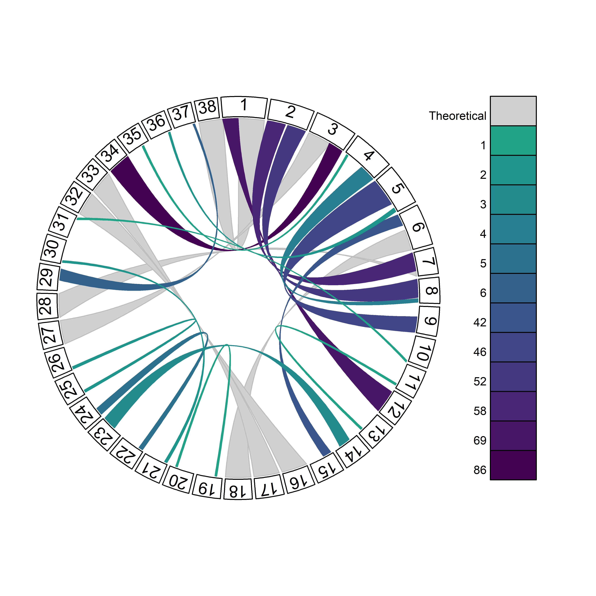
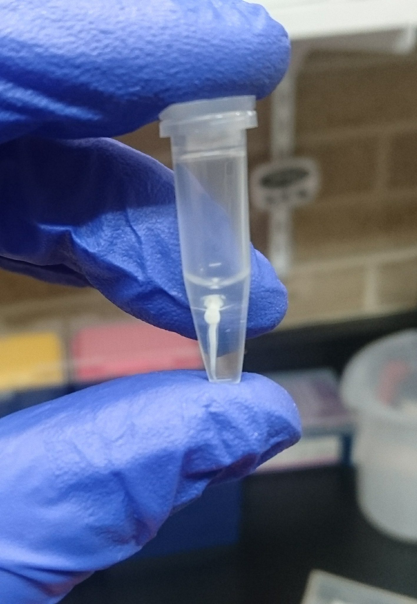

</script>

 

***

## __EDUCATION__

### __Univeristy of New Hampshire__, Durham, NH
- Present - __Ph.D Molecular and Evolutionary Systems Biology __;  
    Genotypic and phonotypic consequences of desert ecology.
 
    Advisor: Matt MacManes 

### __University of Wisconsin - Stevens Point__, Stevens Point, WI    
- 2019 - __M.Sc. in Natural Resources __;  
    M.Sc. Thesis, The first haploid linkage map in a coregonid _(Coregonus artedi)_ improves knowledge of chromosomal evolution and rediploidization across Salmonids.
 
    Advisor: Wes Larson 
    
### __Michigan State Univeristy__, East Lansing, MI  
-  2017 - __BS in Zoology__ 

***
## __PUBLICATIONS__ 
__Blumstein, DM__, The first haploid linkage map in a coregonid _(Coregonus artedi)_ improves knowledge of chromosomal evolution and rediploidization across Salmonids. _Master's thesis. University of Wisconsin-Stevens Point_ 

__Blumstein, DM__, Mays D, Scribner KT. (2017). Spatial genetic structure and recruitment dynamics of burbot (Lota lota) in Eastern Lake Michigan and Michigan tributaries. _Journal of Great Lakes Research_, 44(1):149-156. 

Waraniak JM, __Blumstein DM__, Scribner KT. (2017). Barcoding PCR primers detect larval lake sturgeon (Acipenser fulvescens) in diets of piscine predators. _Conservation Genetics Resources_, 10(2):259-268. 

***
## __RESEARCH PRESENTATIONS__ 
(Presenter bolded) 

__Blumstein DM__, Campbell MA, Hale MC, Sutherland BJG, McKinney GJ, Stott W, Larson WA. (2019). The first haploid linkage map in a coregonid _(Coregonus artedi)_ improves knowledge of chromosomal evolution and rediploidization across Salmonids. International Association for Great Lakes Research 62nd Annual Conference on Great Lakes Research. The College at Brockport, State University of New York _[oral presentation]_

__Blumstein DM__. (2019). The first haploid linkage map in a coregonid _(Coregonus artedi)_ improves knowledge of chromosomal evolution and rediploidization across Salmonids. Master's thesis. University of Wisconsin-Stevens Point. _[oral presentation]_

__Blumstein DM__, Stott W, Larson WA (2019) Development of a genetic linkage map for cisco _(Coregonus artedi)_  to facilitate integrated studies of adaptive diversity (poster). 47th Annual Meeting of the Wisconsin Chapter of the American Fisheries Society. Green Bay, Wisconsin. _[poster]_ 

__Blumstein DM, Stott W__, Larson WA (2018) Development of a genetic linkage map for cisco _(Coregonus artedi)_  to facilitate integrated studies of adaptive diversity. Midwest Fish and Wildlife Conference. Milwaukee, Wisconsin. _[poster]_

__Blumstein DM__, Waraniak JM, Scribner KT (2016) Barcoding PCR primers detect larval lake sturgeon (Acipenser fulvescens) in diets of piscine predators. University Undergraduate Research and Arts Forum, Michigan State University. _[poster]_

__Blumstein DM__, Scribner KT (2015) Genetic assessment of the male reproductive success of lake sturgeon (Acipenser fulvescens) as a function of duration of river occupancy during the spawning season. University Undergraduate Research and Arts Forum, Michigan State University. _[poster]_

***
## __INVITED TALKS__ 
(Presenter bolded) 

__Blumstein DM__, Stott W, Larson WA (2018) Development of a genetic linkage map for cisco _(Coregonus artedi)_  to facilitate integrated studies of adaptive diversity. University of Wisconsin – Stevens Point Student-Sub Unit of American Fisheries Society.

__Blumstein DM__, Stott W, Larson WA (2018) Development of a genetic linkage map for cisco _(Coregonus artedi)_ to facilitate integrated studies of adaptive diversity. USGS Great Lakes Science Center, Ann Arbor, Michigan. 

__Blumstein DM__, Mays D, Scribner KT (2017) Spatial genetic structure and recruitment dynamics of burbot  _(Lota lota)_ in Eastern Lake Michigan and Michigan tributaries. USGS Great Lakes Science Center, Ann Arbor, Michigan. 

***
## __RESEARCH and PROFESIONAL EXPERIENCE__ 

### __Workshops:__ 

_2018_ NFS -funded expert workshop for the development of a global experiment to understand Coregonid adaptive response to changing thermal regimes. Thonon – les – Bains, France. 

_2017_ RAD Sequencing Workshop. Molecular Conservation Genetics Laboratory, University of Wisconsin – Stevens Point. 

_2016_ Microsatellite Genotyping Workshop. Molecular Ecology Laboratory, Michigan State University. 

_2015_ Ecology and Plant Systematics Field Courses. Kellogg Biological Station, Michigan. 2014. MDNR Fish Sampling Techniques Course. Gaylord, Michigan. 

### __Outreach:__ 

_2019_ Judge Jim and Katie Krause College of Natural Resources Student Research Symposium, University of Wisconsin – Stevens Point. 

_2019_ Presenter, STEAM Point Day for Girls (16 middle school students per class). Two class periods: Evolution Board Game. University of Wisconsin – Stevens Point 

_2018_ Guest lecture, Principles of Genetics (Biology 210), University of Wisconsin – Stevens Point 

_2018_ Judge Jim and Katie Krause College of Natural Resources Student Research Symposium, University of Wisconsin – Stevens Point. 

_2018_ Presenter, STEAM Point Day for Boys (16 middle school students per class). Two class periods: Evolution Board Game. University of Wisconsin – Stevens Point 

_2018_ Presenter, STEM Exploration Day at Treehaven (16 middle school students per class). Three class periods: Evolution Board Game. University of Wisconsin – Stevens Point 

### __Manuscripts reviewed for:__ 

 Transactions of the American Fisheries Society (1)

*** 
## __SKILLS__ 
### __Laboratory:__ 
- 96 well Qiagen/Promega DNA extraction (tissue) 
- Qiagen single tube DNA extraction (tissue, diet samples, eDNA, insects)
- Agarose and polyacrylamide gel electrophoresis
- qPCR
- PCR optimization & clean up
- Microsatellite genotyping
- DNA quantification (nanodrop and PicoGreen) 
- Plate prep for ABI 3730
- RAD library preparation and data management

### __Computer:__ 
- Graphing: R, GGPlot, and Excel
- Statistical analysis: R, SAS, Rqtl
- Software: STACKS, ArcMap, GeneMarker, LepMap, BLAST, Colony Parentage Analysis Program
- Coding languages: Java, Python, R 
- App and Web development: RMarkdown, GitPages

### __Field Work:__ 
- Taxanomic: desert rodents, basic fish, aquatic and terrestral invertebrate identification, vascular plants
- Fisheries: Morphometric measurements, barge and backpack electrofishing, kick net, seine net, drift net, fish care and fish feeding, fish disease (prevention, identification,  treatment), tissue sample collection for genetic analyses
- Other: Extensive backcountry camping experience, snorkeling, graphic design, knot tying, driving 4WD vehicles (including manual transmission)

***
## __ADDITIONAL RESOURCES:__

- [Twitter](https://twitter.com/DaniBlumstein)

- [Researchgate](https://www.researchgate.net/profile/Danielle_Blumstein)

- [GitHub](https://github.com/DaniBlumstein)

- [Download CV](pdf/DanielleBlumsteinCV_6_3_19.pdf)

 

