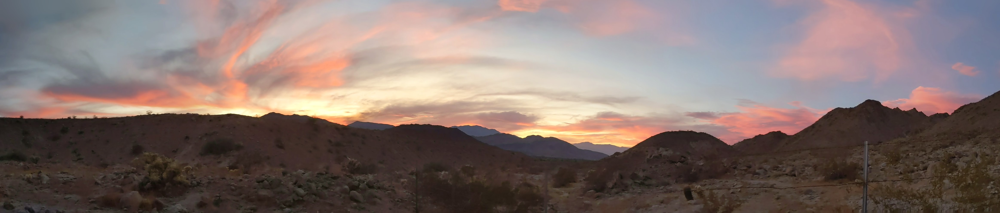
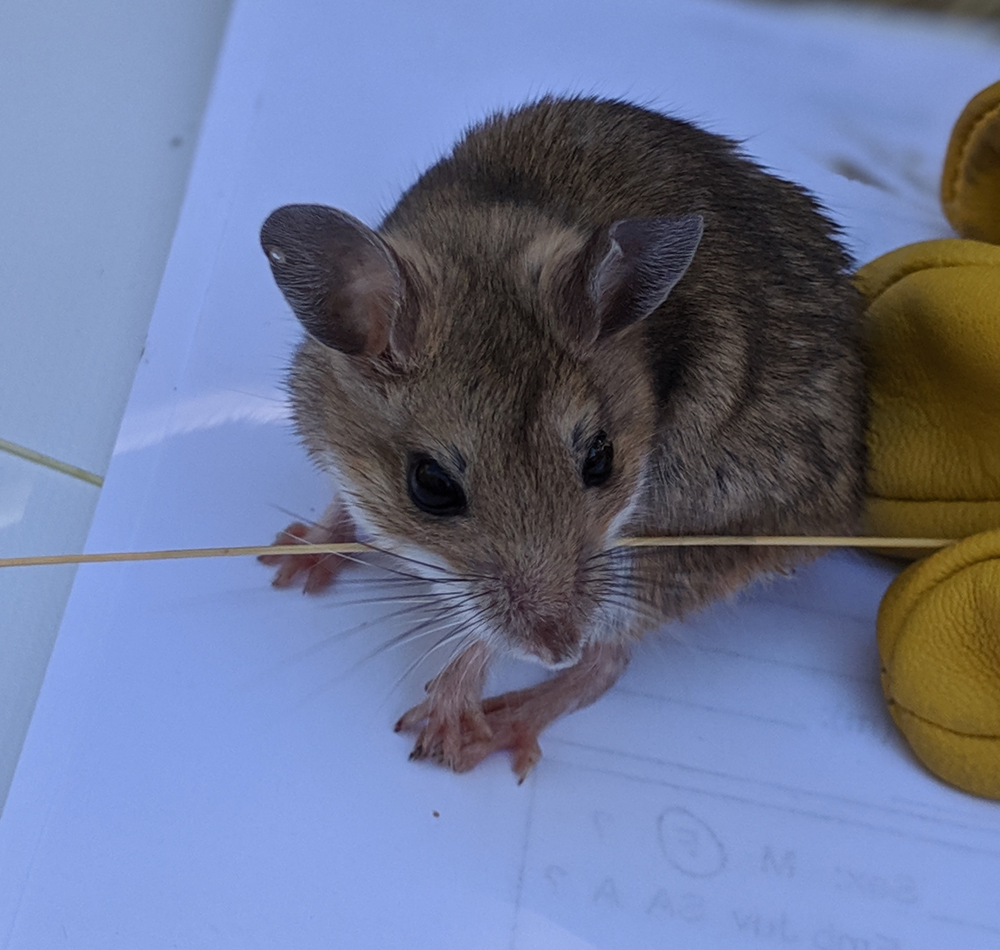

---
title:
output: 
  html_document:
    includes:
       in_header: googleAnalytics.Rhtml
---

</script>

***
</script>
 

 
 

 

# __Danielle Blumstein, Ph.D.__ 
I am interested in genome evolution and adaptive diversity.

 
 
- [PhD lab](https://macmanes.weebly.com/)
 
- [Masters lab](https://larsonlab.wordpress.com/)

 
I'm fascinated by how all animals—whether fish or mammals—are built from the same basic biological toolkit: a genome and the metabolic processes that take raw materials and turns them into energy. I love using this information to figure out how animals live and thrive in such different habitats, from cold northern lakes to hot, dry deserts.

I got my start in research as an undergrad at Michigan State University, where I worked with lake sturgeon, burbot, and aquatic invasive species—collecting and analyzing genetic and ecological data. I also studied global patterns of biodiversity by conducting field and greenhouse experiments across different latitudes.

For my master's degree at the University of Wisconsin–Stevens Point, I focused on cisco and built a haploid genetic map to better understand the evolutionary history of the salmonid family.

During my PhD at the University of New Hampshire, I shifted habitats and studied desert mice (Peromyscus eremicus). I used genomic and physiological tools, like RNA sequencing and respirometry, to understand how these small mammals survive extreme heat and dryness.

Across all of these experiences, my goal has stayed the same: to use the shared biology that makes an animal an animal to understand how life adapts to Earth's many environments.
 

***

<video width=250 height=250 controls>
  <source src="video-1618166532.mp4" type="video/mp4"></video>

</script>
 

***
<left>
Contact me: dani.blumstein@gmail.com
