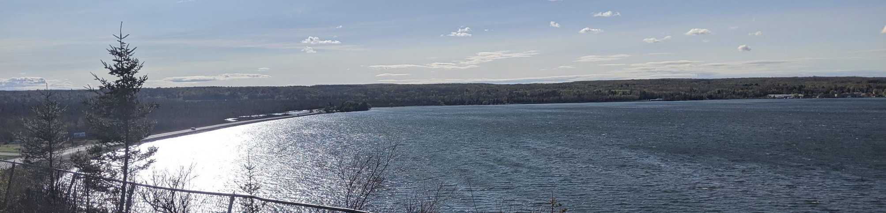
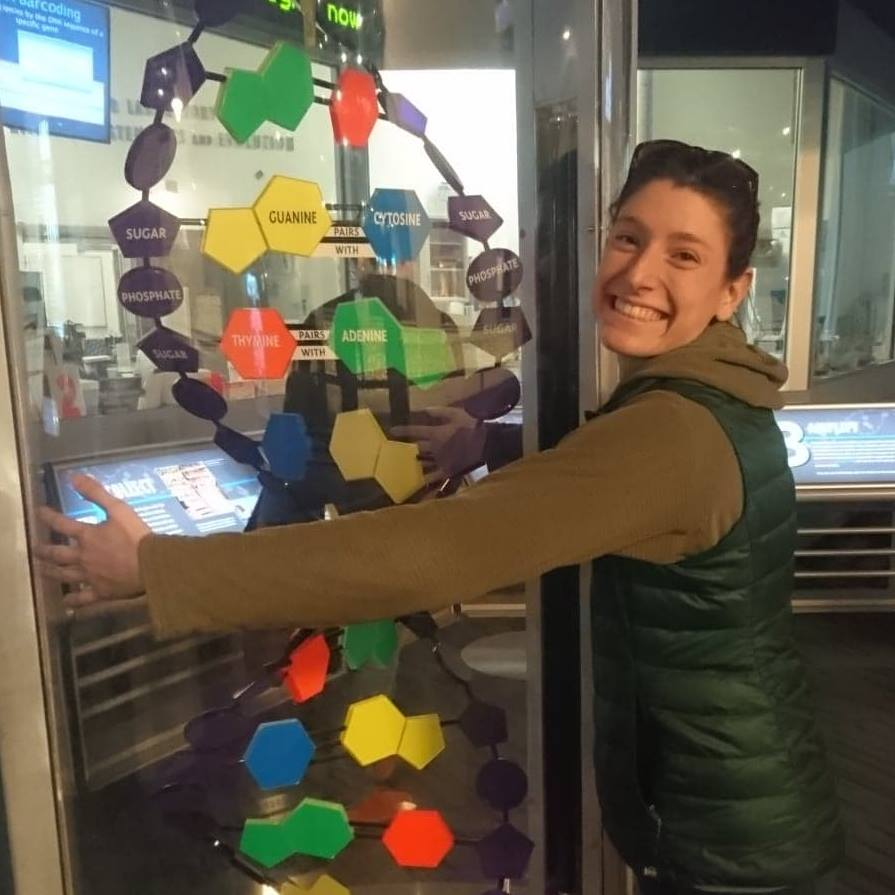
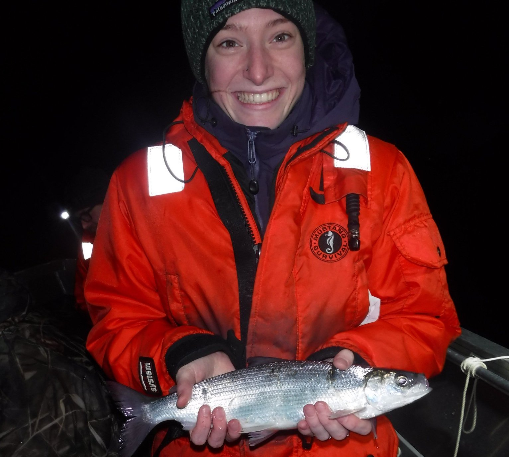
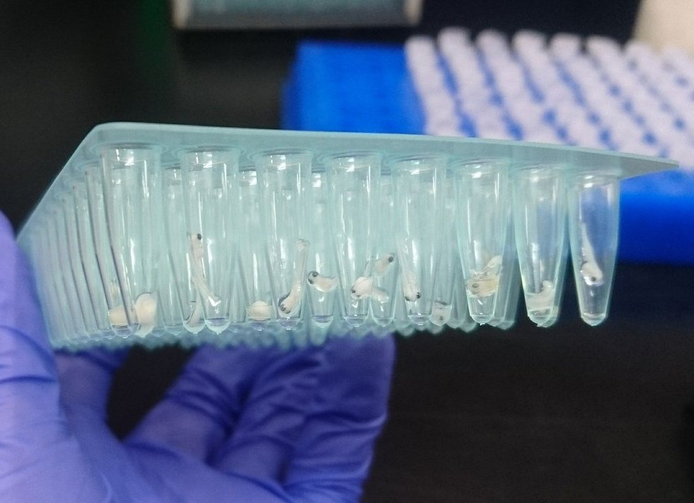

---
title:
output: 
  html_document:
    includes:
       in_header: googleAnalytics.Rhtml
---

</script>

***
</script>
 

 
 

 

# __Danielle Blumstein, Ph.D. Student__ 
I am a PhD student interested in genome evolution and adaptive diversity. My current research is focused on investigating the genomic basis of desert adaptations in desert mice _(Peromyscus)_. 

 
 
- [PhD lab](https://macmanes.weebly.com/)
 
- [Masters lab](https://larsonlab.wordpress.com/)

 
I started getting involved in research as an undergrad at Michigan State University where I worked in two research labs, one where I collected and analyzed genetic and ecological data for lake sturgeon _(Acipenser fulvescens)_, burbot _(Lota lota)_, and various aquatic invasive species and the other where I conducted field and greenhouse experiments to study the latitudinal biodiversty gradient. After completing my B.S. in zoology, I moved to the University of Wisconsin - Stevens Point and earned a M.Sc. in Natural Resources and developed a haploid linkage map for cisco _(Coregonus artedi)_. While the main use of the linkage map will be to examine the cisco species complex and inland and Great Lakes population variation, I used the map to study how the salmonid family has genomically evolved post whole genome duplication.
 

***

<video width=35% height="180" controls>
  <source src="pictures/66068784_104945927385854_2163393502730949168_n.mp4" type="video/mp4">
</video>

</script>
 

***
<left>
Contact me: dani.blumstein@gmail.com or dmb1086@wildcats.unh.edu 

<a href="https://twitter.com/DaniBlumstein" class="twitter-follow-button" data-show-count="false">Follow: @DaniBlumstein</a>

<a class="twitter-timeline" data-width="400" data-height="500" href="https://twitter.com/DaniBlumstein">Tweets by Dani_Blumstein</a> 

 

