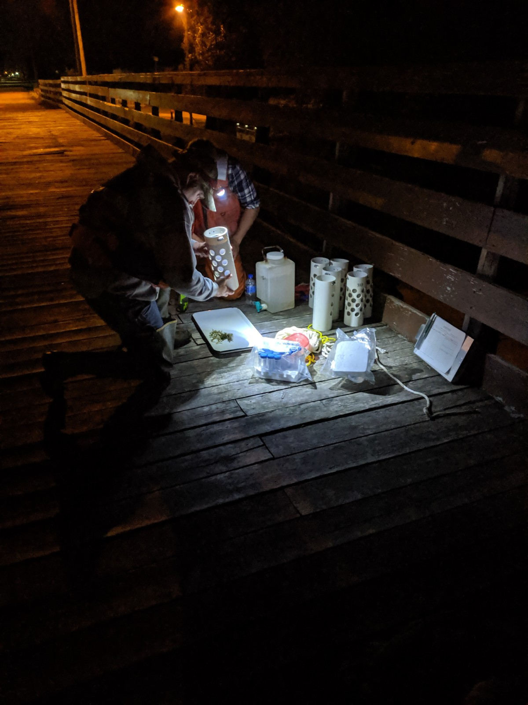
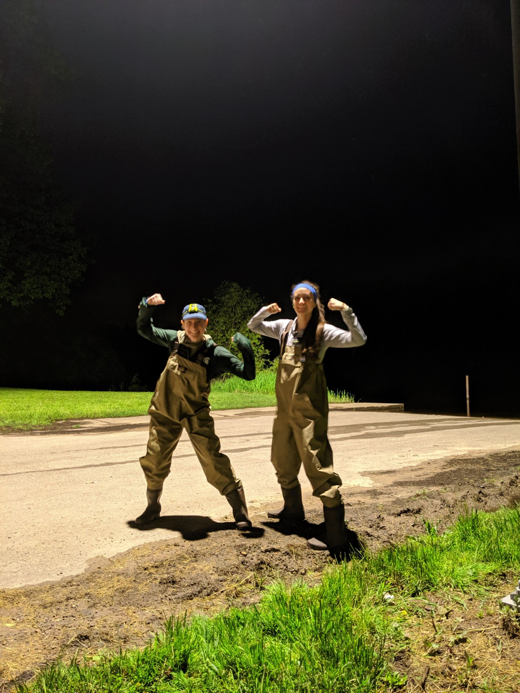

---
title:
output: html_document
---
<html>
<head>
<meta name="viewport" content="width=device-width, initial-scale=1.0">

</head>
<body>

<!-- Header -->

  <h1>Wisconsin Sturgeon Drift</h1>
  
Shawano, WI June 5, 2019.

  <button class="btn" onclick="one()">1</button>
  <button class="btn active" onclick="two()">2</button>
  <button class="btn" onclick="four()">4</button>

<!-- Photo Grid -->

 
  

  IMG_20190530_224222.jpg
    
    
  

  

    
    
  
  
  

    
    
  

  

    
    
  

<video width=100% height="500" controls>
  <source src="pictures/62496104_874684099539510_5830227868588304594_n.mp4" type="video/mp4">
</video>

### __Masters Defense__ 
The first haploid linkage map in a coregonid (Coregonus artedi) improves knowledge of chromosomal evolution and rediploidization across Salmonids  
__Univeristy of Wisconsin - Stevens Point, Stevens Point, WI__ 
May 10, 2019   
 
<video width=100% height="500" controls>
  <source src="masters_defense.mp4" type="video/mp4">
</video>
