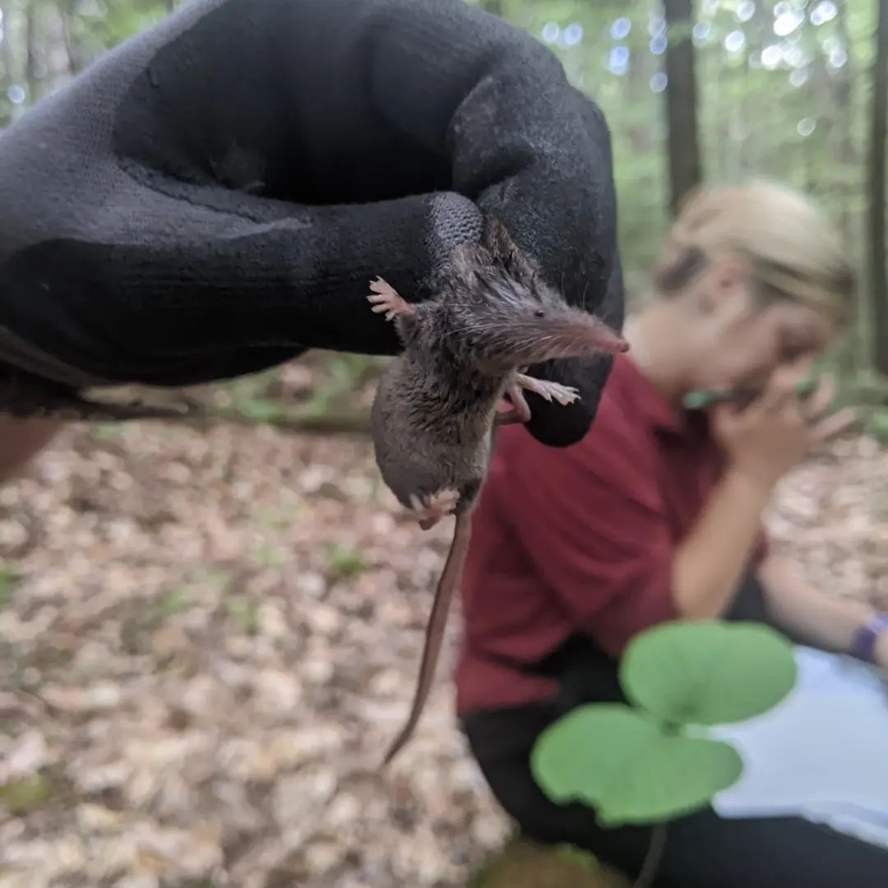

<html>
<head>
<meta name="viewport" content="width=device-width, initial-scale=1.0">

</head>
<body>

<!-- Header -->

  <h1>Bartlett Experimental Forest</h1>
  
National forest in Bartlett, New Hampshire, July, 27-31, 2022

  <button class="btn" onclick="one()">1</button>
  <button class="btn active" onclick="two()">2</button>
  <button class="btn" onclick="four()">4</button>

<!-- Photo Grid -->

 
  

  

  

  
  
  

  

  

  

  

  

 

<video width=100% height="500" controls>
  <source src="pictures/smammals/16.mp4" type="video/mp4">
</video>

<!-- Header -->

  <h1>SICB 2022</h1>
  
January 7, 2022

<video width=100% height="500" controls>
  <source src="pictures/SICB2022.mp4" type="video/mp4">
</video>

<!-- Header -->

  <h1>Graphical Science Communication</h1>
  
Click on the buttons to change the grid view

  <button class="btn" onclick="one()">1</button>
  <button class="btn active" onclick="two()">2</button>
  <button class="btn" onclick="four()">4</button>

<!-- Photo Grid -->

 
  

  

  

<video width=100% controls><source src="3MT_2021_-_Dani_Blumstein_-_March_30_(Source).mp4" type="video/mp4"></video>

  

 

<!-- Header -->

  <h1>Spring MCBS Seminar</h1>
  
April 14, 2020

<iframe width=100% height="500" controls src="https://www.youtube.com/embed/opsahhC6wxY" frameborder="0" allow="accelerometer; autoplay; encrypted-media; gyroscope; picture-in-picture" allowfullscreen></iframe>

<!-- Header -->

  <h1>Southern California</h1>
  
Deep Canyon, Santa Rosa Mt., and Sissors Crossing  Sept 13 - 20, 2019

  
Click on the buttons to change the grid view

  <button class="btn" onclick="one()">1</button>
  <button class="btn active" onclick="two()">2</button>
  <button class="btn" onclick="four()">4</button>

<!-- Photo Grid -->

 
  

  

  

  
  
  

  

  

  

 

<video width=100% height="500" controls>
  <source src="pictures/desert1/VID_20190917_080018.mp4" type="video/mp4">
</video>

<!-- Header -->

  <h1>USGS Kiyi Research Vessel</h1>
  
Lake Superior July 8 - 11, 2019

  <button class="btn" onclick="one()">1</button>
  <button class="btn active" onclick="two()">2</button>
  <button class="btn" onclick="four()">4</button>

<!-- Photo Grid -->

 
  

  

  

  
  
  

  

  

  

 

<video width=100% height="500" controls>
  <source src="pictures/kiyi/VID_20190709_101407.mp4" type="video/mp4">
</video>

<!-- Header -->

  <h1>Wisconsin Sturgeon Drift</h1>
  
Shawano, WI June 5, 2019

  <button class="btn" onclick="one()">1</button>
  <button class="btn active" onclick="two()">2</button>
  <button class="btn" onclick="four()">4</button>

<!-- Photo Grid -->

 
  

  

  

  
  
  

  

  

  

</body>
</html>
 

<video width=100% height="500" controls>
  <source src="pictures/62496104_874684099539510_5830227868588304594_n.mp4" type="video/mp4">
</video>
 

<h1>Masters Defense</h1>
The first haploid linkage map in a coregonid (Coregonus artedi) improves knowledge of chromosomal evolution and rediploidization across Salmonids  
__Univeristy of Wisconsin - Stevens Point, Stevens Point, WI__ 
May 10, 2019   
 
<video width=100% height="500" controls>
  <source src="masters_defense.mp4" type="video/mp4">
</video>
</body>
</html>